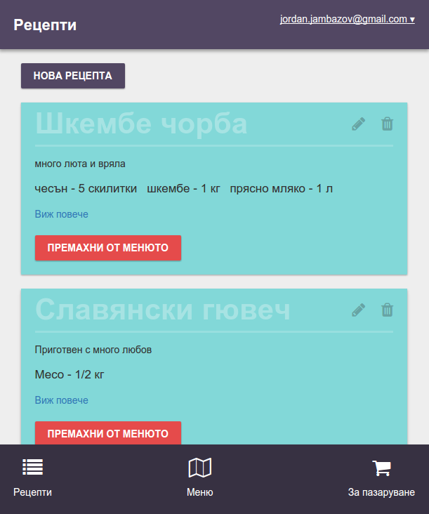
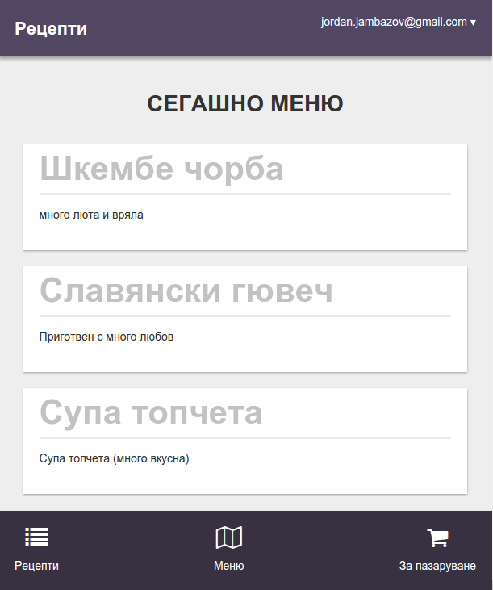
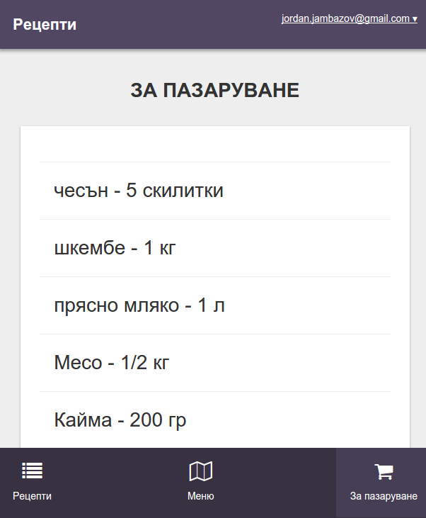

# Recipes

## Description

Application developed in Meteor allowing users to
manage recipes. Those recipes can then be added to their menu. Based on their menu automatically shopping list is getting generated.

## Screenshots

### Recipes

Screen where users can define recipes. Each recipe has name, description and ingredients. Recipes can be added, edited and added to the menu.

### Menu

Screen where users can see their menu.

### Shopping List

The shopping list based on users' menu ingredients.

## Credit

[Intermediate Meteor](https://www.youtube.com/playlist?list=PLLnpHn493BHFYZUSK62aVycgcAouqBt7V)
